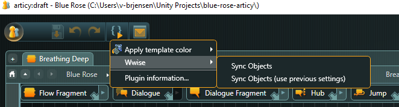

# ScenarioWorld.ArticyWwisePlugin

Automatically generates Articy entities to match events from a Wwise project.

## Usage

Navigate to the Wwise menu from the plugin menu in the main Articy toolbar and select **Sync Objects**

You'll be shown three prompts.

1. A file browser to select the .wproj Wwise project to import from
2. A folder in your Entities folder in Articy to create the entities
3. A template to apply to newly created entities

When done, the selected folder will be populated with one entity per Wwise Event in the project. Each entity will have the selected template and its Technical Name will be set to **WWISE_{Event Name from Wwise}**.